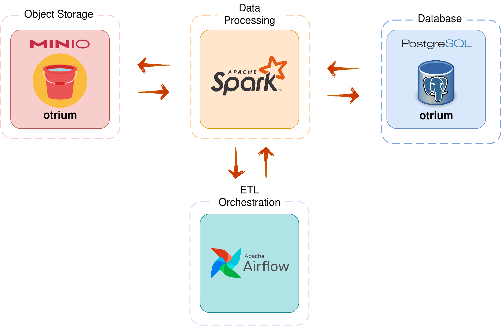
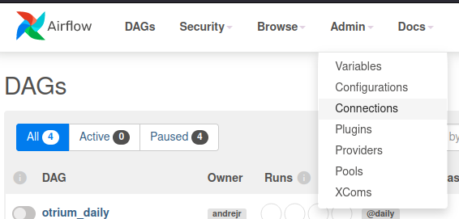
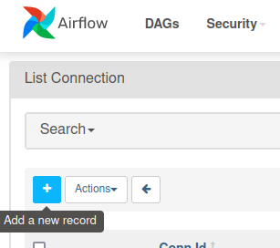

## Table of contents
- [Table of contents](#table-of-contents)
- [Project Requirements](#project-requirements)
- [Project Structure](#project-structure)
- [High Level Architecture](#high-level-architecture)
- [:ship: Containers](#ship-containers)
- [Step-by-Step](#step-by-step)
  - [1. Clone the Repository](#1-clone-the-repository)
  - [2. Setup environment](#2-setup-environment)
  - [3. Airflow: Create user for UI](#3-airflow-create-user-for-ui)
  - [3.1 Airflow: Postgres, MinIO & Spark connections configuration](#31-airflow-postgres-minio--spark-connections-configuration)
    - [Postgres](#postgres)
    - [MinIO](#minio)
    - [Spark](#spark)
- [Stack](#stack)
- [References](#references)

## Project Requirements

This project was develop and tested using the following environment.


|   Item             |        Version        |
|----------------|-------------------------------|
|Ubuntu          |`22.04.1 LTS`|
|Docker|`20.10.17, build 100c701`            |
|Docker Compose          |`1.29.2, build 5becea4c`            |
|Visual Studio Code          |`1.71.0`|
|Python          |`3.10.4`|
|OpenJDK          |`11.0.16`|
|Git          |`2.34.1`|


> If due to license issues you are not allowed to use Docker it's possible to replace it with [Podman](https://podman.io/) which is an alternative highly recommended for companies such as RedHat.

## Project Structure
 

This challenge is currently structured with the following specifications.

|   Path             |        Description        |
|----------------|-------------------------------|
|src|`Dockefile, dags and Spark applications`            |

##  High Level Architecture

  



## :ship: Containers

* **airflow-webserver**: Airflow v2.2.4 (Webserver & Scheduler)
    * image: andrejunior/airflow-spark:latest | Based on python:3.8-buster
    * port: 8085 
  
* **postgres**: Postgres database (Airflow metadata and our pipeline)
    * image: postgres:14-bullseye
    * port: 5432

* **spark-master**: Spark Master
    * image: bitnami/spark:3.2.1
    * port: 8081

* **spark-worker**: Spark workers
    * image: bitnami/spark:3.2.1

*  **MinIO**: Object storage

   - image: bitnami/minio:latest
    
## Step-by-Step

### 1. Clone the Repository

`git clone https://github.com/andrejnevesjr/airflow-spark-minio-postgres.git`

### 2. Setup environment

```
cd otrium-challenge
docker-compose -f docker-compose.yml up -d
```
 

### 3. Airflow: Create user for UI
To access Airflow UI is required to create a new user account, so in our case, we are going to create an fictional user with an Admin role attached.

> **NOTE**: Before **RUN** the command below please confirm that Airflow is up and running, it can be checked by accessing the URL [http://localhost:8085](http://localhost:8085). Have in mind that in the first execution it may take 2 to 3 minutes :stuck_out_tongue_winking_eye:


docker-compose run airflow-webserver airflow users create --role Admin --username airflow \
      --email airflow@example.com --firstname airflow --lastname airflow --password airflow

### 3.1 Airflow: Postgres, MinIO & Spark connections configuration

1. Open the service in your browser at http://localhost:8085
   Use the credentials 
   ```
   User: airflow
   Password: airflow
   ```

2. Click on Admin -> Connections in the top bar.
    

3. Click on + sign and fill in the necessary details for each source below:
    
  
#### Postgres

    Conn Id: postgres_conn
    Conn Type: Postgres
    Host: postgres
    Schema: airflow
    Login: airflow
    Password: airflow
    Port: 5432
 

####   MinIO

    Conn ID: minio_conn
    Conn Type: Amazon S3
    Extra: consists of the JSON below:
```
    { "aws_access_key_id":"airflow",
      "aws_secret_access_key": "airflow",
      "host": "http://bucket:9000"
    }
```
####   Spark

    Conn ID: spark_conn
    Host: spark://spark
    Port: 7077
    Extra: consists of the JSON below:
```
{"queue": "root.default"}
```


## Stack

|        Application        |URL                          |Credentials                         |
|----------------|-------------------------------|-----------------------------|
|Airflow| [http://localhost:8085](http://localhost:8085) | ``` User: airflow``` <br> ``` Pass: airflow``` |         |
|MinIO| [http://localhost:9001](http://localhost:9001) | ``` User: airflow``` <br> ``` Pass: airflow``` |           |
|Postgres| **Server/Database:** localhost:5432/airflow | ``` User: airflow``` <br> ``` Pass: airflow``` |           |
|Spark (Master) | [http://localhost:8081](http://localhost:8081)|  |         |
  

## References

[airflow.apache.org](https://airflow.apache.org/docs/apache-airflow/stable/)

[puckel/docker-airflow](https://github.com/puckel/docker-airflow)

 [cordon-thiago/airflow-spark](https://github.com/cordon-thiago/airflow-spark/)

 [pyjaime/docker-airflow-spark](https://github.com/pyjaime/docker-airflow-spark/)
